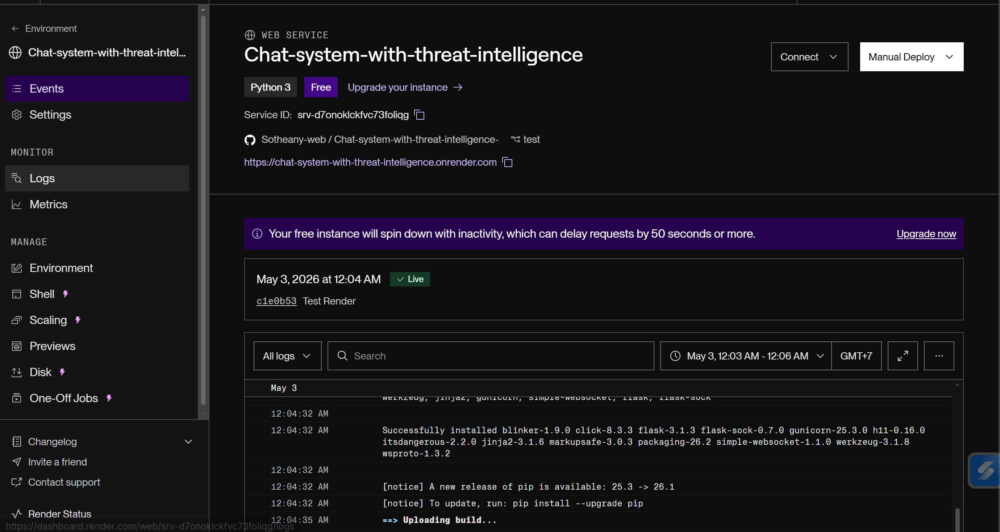
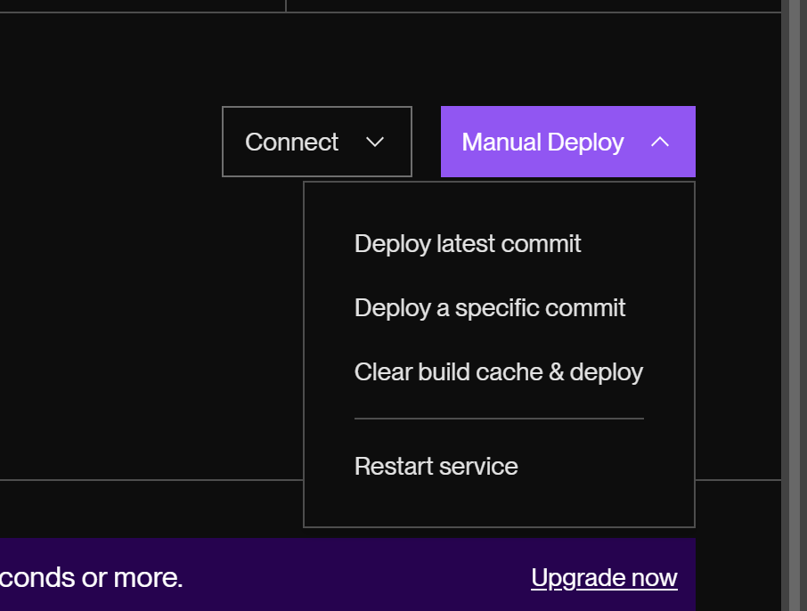

# Hosting the Website on Render

## 🚀 Technologies Used
- Render (Cloud Hosting)

## 📖 Deployment Steps
1. Go to [Render Dashboard](https://dashboard.render.com/web/srv-d7onoklckfvc73foliqg/deploys/dep-d7r2t2d7vvec738khjrg?r=2026-05-02%4017%3A03%3A09~2026-05-02%4017%3A06%3A46)
2. Log in with your account  
   - Email: `vansotheany0000@gmail.com`  
   - Username: `theany3957`
3. Navigate to **Events** in the sidebar

4. Click **Clear Build Cache** and then **Deploy**

---

## 🌐 Result
The web app will start deploying automatically.

